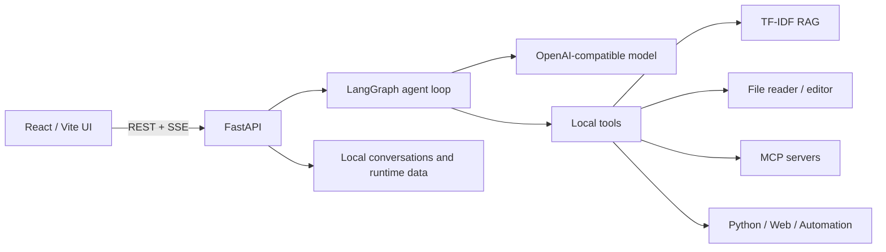

# AI Agent

A personal learning and experimentation project for building a local, tool-using AI
agent. It is tested against a real rental-management system through MCP, while keeping
private credentials, conversations, memory, uploads, and runtime data local.

## What it demonstrates

- LangGraph agent loop with native OpenAI-compatible tool calls and SSE streaming.
- React/Vite interface for chat, model configuration, RAG data, automation, and MCP.
- Local RAG over knowledge, memory, and skills using TF-IDF character n-grams.
- PDF, Word, PowerPoint, Excel, HTML, CSV, Markdown, and source-file extraction.
- Simple or bounded LLM-assisted document chunking with incremental cache reuse.
- Approval controls for file editing, Python execution, MCP writes, and automation.
- Markdown, images, tables, and KaTeX formula rendering.

## Architecture



Each turn builds compact context, calls the selected model, executes approved tools,
streams progress to the UI, and saves the complete conversation locally. Uploaded
documents can be extracted to Markdown, chunked, indexed, and searched without sending
the full knowledge base to the model.

## Quick start

Requirements: Python 3.11+, Node.js 20.19+ (or 22.12+), and npm.

```bash
git clone https://github.com/HungryNeko/AI_Agent.git
cd AI_Agent

python3 -m venv .venv
.venv/bin/python -m pip install -e './backend[dev]'
npm --prefix frontend ci

cp backend/.env.example backend/.env
# Add the API key for the provider you want to test.

./start_dev.sh
```

Open <http://127.0.0.1:5173>. Press `Ctrl+C` to stop both services.

Run the checks separately:

```bash
.venv/bin/python -m pytest backend/tests
npm --prefix frontend run build
```

## Project layout

```text
backend/              FastAPI, LangGraph, prompts, tools, and tests
frontend/src/App.jsx  React application and feature views
data/                 Safe templates and versioned skills
docs/                 Focused implementation notes
start_dev.sh          macOS/Linux development launcher
start_dev.ps1         Windows development launcher
```

## Privacy and scope

This is an educational project, not a production SaaS product. Real-system testing is
performed through configured MCP boundaries and approval rules. `.env`, local model and
MCP configuration, conversations, private memory, uploads, RAG indexes, virtual
environments, and downloaded model files are excluded by `.gitignore`; only safe example
configuration is versioned.
