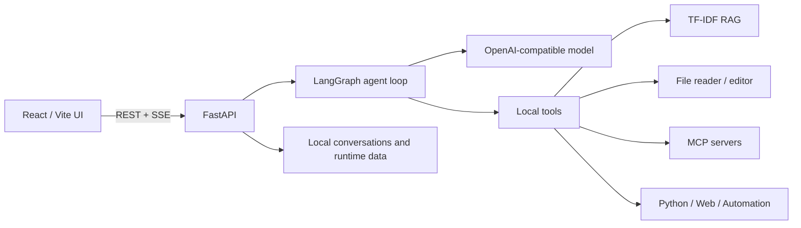

# AI Agent

A personal learning and experimentation project for building a local, tool-using AI
agent. It is tested against a real rental-management system through MCP, while keeping
private credentials, conversations, memory, uploads, and runtime data local.

## What it demonstrates

- LangGraph agent loop with native OpenAI-compatible tool calls and SSE streaming.
- React/Vite interface for chat, model configuration, RAG data, automation, and MCP.
- Ask, Plan, and Agent modes, with a reviewable session plan before implementation.
- User questions with free text, choices, refusal, redirection, and a minimizable dialog.
- Conversation branches, queued messages, insertion, and pause/resume controls.
- Reusable Python tools created in the Tools page or by the agent as `custom__name`.
- Provider model-list refresh and per-conversation model switching without exposing keys
  to the model.
- Local RAG over knowledge, memory, and skills using TF-IDF character n-grams.
- PDF, Word, PowerPoint, Excel, HTML, CSV, Markdown, and source-file extraction.
- Simple or bounded LLM-assisted document chunking with incremental cache reuse.
- Approval controls for file editing, Python execution, MCP writes, and automation.
- Markdown, images, tables, and KaTeX formula rendering.

## Architecture


```mermaid
flowchart LR
    UI[React / Vite UI] -->|REST + SSE| API[FastAPI]
    API --> GRAPH[LangGraph agent loop]
    GRAPH --> LLM[OpenAI-compatible model]
    GRAPH --> TOOLS[Local tools]
    TOOLS --> RAG[TF-IDF RAG]
    TOOLS --> FILES[File reader / editor]
    TOOLS --> MCP[MCP servers]
    TOOLS --> AUTO[Python / Web / Automation]
    API --> STATE[Local conversations and runtime data]
```

Each turn builds compact context, calls the selected model, executes approved tools,
streams progress to the UI, and saves the complete conversation locally. Uploaded
documents can be extracted to Markdown, chunked, indexed, and searched without sending
the full knowledge base to the model.

## Quick start

Requirements: Python 3.11+, Node.js 20.19+ (or 22.12+), and npm.

### Windows / Conda

From the repository root, use the existing `sde` environment:

```powershell
conda activate sde
python -m pip install -e "./backend[dev]"
npm.cmd ci --prefix frontend
if (!(Test-Path backend/.env)) { Copy-Item backend/.env.example backend/.env }
# Set DEEPSEEK_API_KEY in backend/.env, or configure another provider in Models.
powershell -ExecutionPolicy Bypass -File .\start_dev.ps1
```

Open <http://127.0.0.1:5173>. The launcher starts the backend on `8012` and
frontend on `5173` in separate terminals. It stops existing listeners on its
development ports before starting; do not use it while those ports serve other work.

### macOS / Linux

```bash
git clone https://github.com/HungryNeko/AI_Agent.git
cd AI_Agent

python3 -m venv .venv
.venv/bin/python -m pip install -e './backend[dev]'
npm --prefix frontend ci

cp backend/.env.example backend/.env
# Add the API key for the provider you want to test.

./start_dev.sh
```

Open <http://127.0.0.1:5173>. Press `Ctrl+C` to stop both services.

Run the checks separately:

```bash
.venv/bin/python -m pytest backend/tests
npm --prefix frontend run build
```

## Project layout

```text
backend/              FastAPI, LangGraph, prompts, tools, and tests
frontend/src/App.jsx  React application and feature views
data/                 Safe templates and versioned skills
docs/                 Focused implementation notes
start_dev.sh          macOS/Linux development launcher
start_dev.ps1         Windows development launcher
```

## Test workflows

- **Ask**: investigate using search, RAG search, HTTP GET, history, and read-only file
  tools. Python execution, MCP calls, RAG ingestion, and file changes are unavailable.
- **Plan**: inspect and clarify requirements, then update/finalize a plan in conversation
  state. Review, revise, reject, save a Markdown copy, or approve and hand off to Agent.
- **Agent**: execute tasks using enabled tools and the selected approval policy. The
  default file-edit approval is `auto`; choose `manual`, `readOnly`, or `aiReview` before
  testing with sensitive project files.

The composer toolbar selects the mode and model. During a run, queue another message
or insert it after stopping the current run. Pause takes effect between emitted events;
it does not cancel an HTTP request or tool already in progress. Branches reconstruct
context from the selected history prefix, rather than replaying an exact checkpoint.

In **Models**, configure a provider URL/key and refresh its OpenAI-compatible `/models`
list. In **MCP**, enter a Streamable HTTP URL and header key/value pairs, save, then test
the connection; `command` is only needed for stdio servers. In **Tools**, save reusable
Python code defining `run(arguments)` with an object JSON Schema. These tools are stored
under `data/custom_tools`; explicit plan exports go to `data/plans`.

Fixed rules and instructions stay at the beginning of the first system message for
cache reuse. The textual `available` list is injected on the first turn and after tool
request errors, not every turn. Native OpenAI tool schemas still accompany each model
request so the available functions reflect the current mode and settings.

See [backend setup and tools](backend/README.md), [frontend controls](frontend/README.md),
and [RAG ingestion](docs/rag-ingestion.md) for focused details.

## Privacy and scope

This is an educational project, not a production SaaS product. Real-system testing is
performed through configured MCP boundaries and approval rules. `.env`, local model and
MCP configuration, conversations, private memory, uploads, RAG indexes, virtual
environments, and downloaded model files are excluded by `.gitignore`; only safe example
configuration is versioned.

Python and user-created tools are local execution helpers, not a hardened isolation
boundary. Use trusted code and configured MCP servers; developer mode changes testing
instructions but does not disable backend permissions or disclose credentials.
